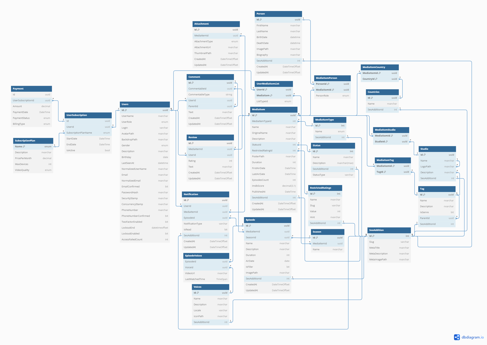

# Онлайн Кінотеатр

## 1. Загальна інформація

**Проект:** Онлайн кінотеатр  
**Технології:** ASP.NET Core (Backend), ReactJS / Angular (Frontend), Реляційна база даних (MS SQL Server)  
**Аналоги:** sweet.tv, megogo, netflix  

## 2. Цілі та завдання проекту

Розробити онлайн кінотеатр, який дозволить користувачам переглядати фільми, серіали, мультфільми та інші відеоматеріали в режимі реального часу через веб-додаток. Система повинна підтримувати як платний, так і безкоштовний доступ до контенту.

## 3. Архітектура

- **Rest API (JSON) або GraphQL**
- **ASP.NET Core (.NET 8)**
- **Мінімум трьох шарова архітектура**: 
  - **Persistence Layer** (робота з БД)
  - **Domain Layer** (бізнес логіка)
  - **Presentation Layer** (UI, інтерфейс користувача)

**Приклади архітектур:**
- Середня важкість: [ASP NovelCatalog](https://github.com/Denys1209/ASP/tree/main/NovelCatalog)
- Складна архітектура (CQRS): [CQRS Starter Kit](https://medium.com/@smagurauskas/asp-net-project-starter-kit-b67427b99a64)

## 4. Функціональні можливості

### 4.1. Аутентифікація та авторизація
- OAuth 2
- Remember Me
- Email Verification
- Password Confirmation
- Password Reset
- Password Update
- Two Factor Authentication (для платних підписок)
- Profile Management with subscribers management (для платних підписок)
- Auth by Google та інші соц. мережі
- Рольова система (адміни, користувачі, можливо модератори)
- Browser Sessions (за бажанням)

### 4.2. Бізнес сутності (управління контентом)
- CRUD фільми та серіали (супорт епізодів)
- Жанри та теги ([IMDb Example](https://www.imdb.com/interest/all/), [Tag Example](https://anidb.net/anime/17617))
- Пошук та фільтрація (повнотекстовий пошук, [Приклади](https://youtu.be/4c0vjXR9Ip4))
- Персонажі/Актори, Автори ([The Movie Database](https://www.themoviedb.org/movie/718821-twisters))
- Медіа (постери, сцени, трейлери, відео, музика)
- Списки користувачів (улюблене, дивлюсь, відкладено, в планах, кинуто, завершено)
- Типи (фільм, серіал, мультфільм)
- Статус (завершений, анонс, виходить)
- Вікові рейтинги (G, PG, PG-13, R, R-17, R+)
- Озвучки
- Плеєри
- Країни, Мови
- Студії
- Рейтинги (10 зірковий) + Рецензії ([Огляди](https://anilib.me/ru/anime/22750--oshi-no-ko-2nd-season-anime?section=review))
- Коментарії (з можливістю reply)
- Тарифні плани

### 4.3. Додаткові функціональні можливості
- Історії переглядів
- Продовження перегляду
- Система рекомендацій
- Швидкий пошук по назві, опису, жанрам, тегам, акторам
- Можливість пропускати інтро
- Автоматична система модерації коментарів
- Перегляд лише з підпискою (якщо є)
- Адмін панель (статистика, додавання нових фільмів/серіалів)
- Система нотифікацій (розсилка про нові фільми/серіали, нові серії)
- Головна сторінка ([Приклади](https://tv.kyivstar.ua/ru/movies))
- Автопродовження, Автостарт, Авто пропуск інтро
- Автоматичне додавання нових фільмів/серіалів/епізодів
- Спільний перегляд ([Anime Buff Rooms](https://animebuff.ru/rooms))
- Топ (список топів)
- Система підтримки користувачів (консультація, підтримка)
- Оплата (якщо буде)

## 5. Нефункціональні вимоги

### 5.1. Продуктивність
- Підтримка до 100,000 одночасних сесій

### 5.2. Безпека
- Захист даних користувачів через шифрування (SSL/TLS)
- Захист від SQL-ін'єкцій, XSS та CSRF атак

### 5.3. Масштабованість
- Система повинна бути масштабованою

### 5.4. Портативність
- Адаптація фронтенду для різних пристроїв (десктоп, планшет, мобільні пристрої)

### 5.5. Локалізація (за бажанням)
- Підтримка багатомовності (українська, англійська, російська)

## 6. Технологічний стек

### 6.1. Backend
- ASP.NET 6.0+ (Web API)
- Entity Framework Core
- IdentityServer для автентифікації та авторизації

### 6.2. Frontend
- ReactJS 18+, Angular 17+
- Redux/Zustand для управління станом (за бажанням)
- Фреймворк UI компонентів

### 6.3. База даних
- Microsoft SQL Server або PostgreSQL, MySQL

### 6.4. Хостинг та розгортання
- Azure App Services для хостингу бекенду
- Azure SQL Database для бази даних
- Azure Storage для зберігання відеоконтенту (за бажанням)
- GitHub Actions/Azure DevOps для CI/CD (за бажанням)

## 7. Етапи розробки

### 7.1. Проектування
- Моделювання архітектури системи
- Проектування бази даних
- Створення макетів UI

### 7.2. Розробка
- Розробка бекенду (API для управління користувачами, контентом)
- Розробка фронтенду (React додаток)
- Інтеграція з платіжними системами

### 7.3. Тестування
- Юніт тести для бекенду та фронтенду
- Інтеграційне тестування
- Тестування продуктивності та безпеки

### 7.4. Розгортання
- Налаштування хостингу та деплой на Azure
- Моніторинг та підтримка

## 8. Документація (якщо буде час)
- Технічна документація по API
- Керівництво користувача
- Документація для розробників

## ([ERD])(https://dbdiagram.io/d/66e1befc6dde7f4149cb9386)

